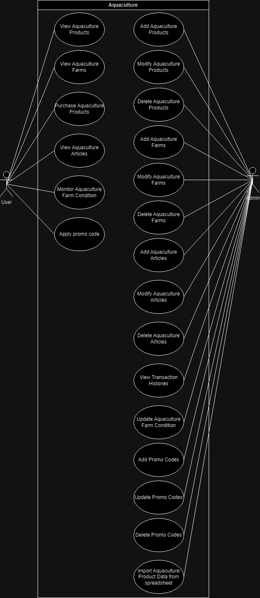

# Aquaculture 

## About Project
this project is directed to the aquaculture life, fish, seaweed and shellfish and other aquatic lifes and their farming methods.

## Features
Managing aquaculture products (mainly fish,seaweed,shellfish) and fish farms (mainly fish farming, seaweed cultivation, shellfish farming )
Monitor aquaculture farms 
Performing registeration and login as both end-user and admin
Performing transactions 

### User
- Performing Register/Login
- View Aquaculture Products (Fish,Seaweed,Shellfish etc)
- View Aquaculture Farms (Fish farming,Seaweed cultivation,Shellfish farming etc)
- View Aquaculture Articles (news, tips etc)
- Purchase Products

### Admin
- Performing Login
- Manage Aquaculture Products (Fish,Seaweed,Shellfish etc)
- Manage Aquaculture Farms (Fish farming,Seaweed cultivation,Shellfish farming etc)
- Manage Aquaculture Articles (news, tips etc)
- View Transactions

## Tech Stacks
- Golang: https://go.dev/
- Echo Framework: https://echo.labstack.com/docs
- Gorm: https://gorm.io/docs/
- Echo JWT middleware: https://echo.labstack.com/docs/cookbook/jwt
- Echo Logger middleware: https://github.com/labstack/echo
- Validator: https://github.com/go-playground/validator
- Vektra's Mockery: https://vektra.github.io/mockery/latest/installation/#go-install
- Testify/Assert: https://github.com/stretchr/testify
- Viper: https://github.com/spf13/viper
- Docker: https://www.docker.com/
- Koyeb: https://app.koyeb.com/
- Supabase: https://supabase.com/

## API Documentation
Postman: https://documenter.getpostman.com/view/37379650/2sAXqqc2op

## ERD

## Setup 
1) Run XAMPP or mysql as a root user 
2) Create the database using the query "CREATE DATABASE aquaculture;"
3) Run the command "go run main.go" to initiate the API
